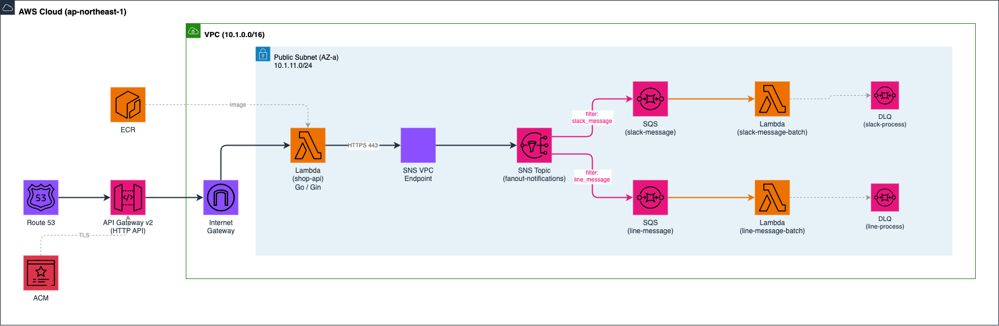
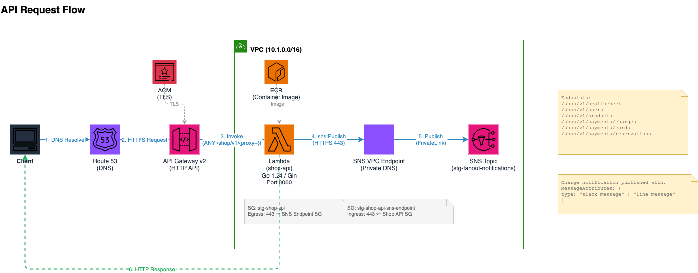
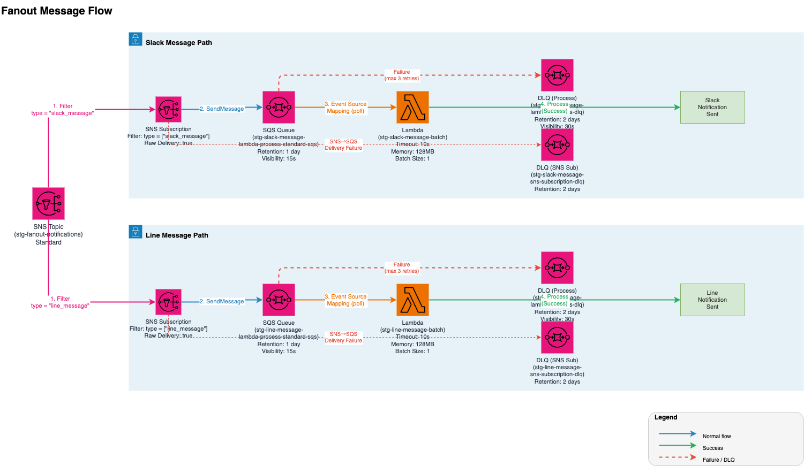

# アーキテクチャ図

[English version](README.md)

SNS/SQS Lambda Fanout プロジェクトのアーキテクチャ図を draw.io (`.drawio`) 形式で管理。
[draw.io Desktop](https://www.drawio.com/)、[VS Code 拡張](https://marketplace.visualstudio.com/items?itemName=hediet.vscode-drawio)、[app.diagrams.net](https://app.diagrams.net) で開けます。

## 01. Infrastructure Overview

> [`01_infrastructure_overview.drawio`](01_infrastructure_overview.drawio)

VPC (10.1.0.0/16) 内に Public Subnet (AZ-a: 10.1.11.0/24 / AZ-d: 10.1.12.0/24) を配置。主要サービス: Lambda x3 (Shop API, Slack Batch, Line Batch), API Gateway v2, SNS, SQS x2, DLQ x4, ECR, Route 53, ACM, SNS VPC Endpoint, Internet Gateway。

## 02. API Request Flow

> [`02_api_request_flow.drawio`](02_api_request_flow.drawio)

Client → Route 53 → API Gateway v2 (HTTP, ACM TLS) → Lambda (shop-api, Gin framework, port 8080) → SNS VPC Endpoint (Private DNS, HTTPS 443) → SNS Topic (stg-fanout-notifications)。Shop API が決済通知をメッセージ属性付きで publish し、ファンアウトフィルタリングに利用。

## 03. Fanout Message Flow

> [`03_fanout_message_flow.drawio`](03_fanout_message_flow.drawio)

SNS Topic が `type` 属性でメッセージをフィルタリング: `slack_message` → Slack SQS Queue、`line_message` → Line SQS Queue。Raw Message Delivery 有効。各キューが専用 Lambda をトリガー (batch_size=1)。処理失敗メッセージ (最大 3 回リトライ) は DLQ へ転送 (保持期間 2 日)。SNS サブスクリプション障害も専用 DLQ で補足。

